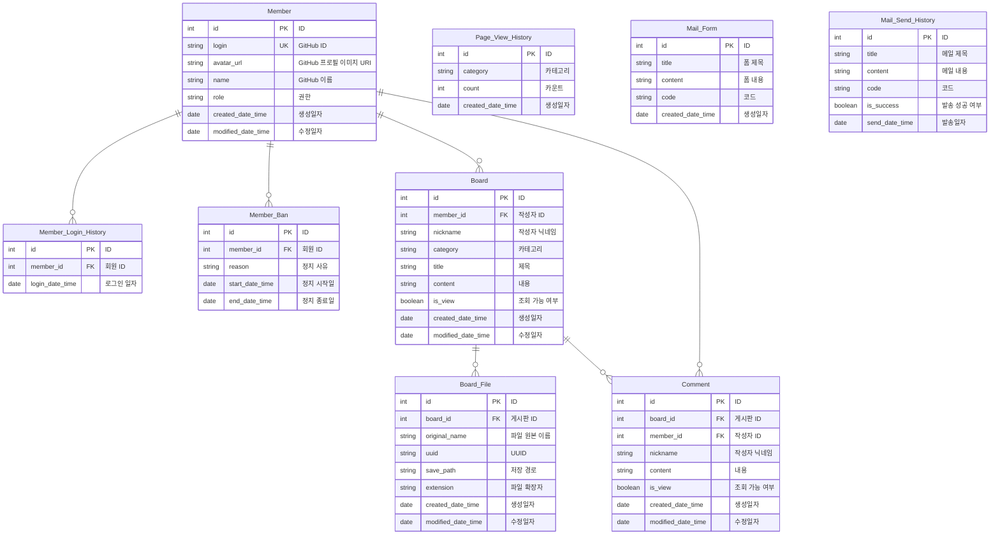

> 개발자를 위한 Github 계정 및 저장소 정보 공유 서비스
>    [Git Connect 프로젝트 상세 기획 Notion](https://jjangsky.notion.site/)
>   Serivce : [git-connect.site](https://git-connect.site)

## 기술 스택

**`JDK 17`**

- 선택 이유

**`SpringBoot 3.3.2`**

- 선택 이유

**`Keycloak`**

- 선택 이유

**`MySQL 8.4`**

- 선택 이유

**`Redis`**

- 선택 이유

**`Elasticsearch`**

- 선택 이유

**`Docker`**

- 선택 이유

**`GitHub Actions`**

- 선택 이유

## 주요 기능

**`사용자 인증 (GitHub API)`**

- **로그인:** GitHub 계정을 사용하여 OAuth 통합을 통해 로그인 기능 제공.

**`팔로우 관리 (GitHub API)`**

- **팔로워/팔로잉 목록 확인:** 사용자의 팔로워와 팔로잉 목록을 GitHub API를 통해 조회 및 상세 정보 제공.

**`계정 홍보`**

- **홍보 등록:** 사용자가 자신의 GitHub 계정을 홍보할 수 있도록 등록 기능 제공(자기소개, 주요 프로젝트, 기술 스킬 등 포함).
- **홍보 조회:** 다른 사용자의 홍보된 계정을 조회할 수 있는 기능.
- **홍보 수정:** 사용자 자신의 홍보 내용을 수정할 수 있는 기능.
- **홍보 삭제:** 홍보 내용을 삭제할 수 있는 기능.

**`저장소 홍보 관리`**

- **저장소 홍보 등록:** 사용자가 자신의 GitHub 저장소를 등록하여 추적 및 홍보할 수 있는 기능 제공.
- **저장소 조회:** 사용자가 등록한 저장소를 조회할 수 있는 기능.
- **저장소 홍보 수정:** 저장소 홍보 게시글 정보를 수정할 수 있는 기능.
- **저장소 홍보 삭제:** 등록한 저장소 홍보 게시글을 삭제할 수 있는 기능.

**`팔로우 요청 (GitHub API)`**

- **팔로우 요청 보내기:** 사용자가 다른 GitHub 사용자를 팔로우할 수 있는 기능 제공.

**`메시징 시스템 (Redis)`**

- **메시지 보내기:** 사용자가 서로 메시지를 주고받을 수 있도록 Redis를 이용한 실시간 메시징 기능 제공.

**`알림 시스템`**

- **실시간 알림:** 팔로우 요청, 메시지 수신, 저장소 업데이트 등 주요 활동에 대한 실시간 알림 제공.

## 아키텍처

- 준비중

## ERD

## API 명세서

- 준비중

## 트러블 슈팅

- 준비중

## 브랜치 전략

> 이 프로젝트는 GitHub Flow 브랜치 전략을 따릅니다.

### 기본 원칙

1. **main 브랜치**는 항상 배포 가능한 상태를 유지합니다.
2. 새로운 기능이나 버그 수정은 **main 브랜치에서 분기**하여 작업합니다.
3. 기능이 완성되면 **Pull Request를 생성**하여 코드 리뷰를 요청합니다.
4. 리뷰가 완료되고 승인이 나면 **main 브랜치에 병합**합니다.
5. 병합 후, **main 브랜치에서 최신 상태**를 유지합니다.

## 커밋 컨벤션

- **feat:** 새로운 기능 추가.
- **fix:** 버그 수정.
- **docs:** 문서 관련 변경 사항.
- **style:** 코드 포맷팅, 세미콜론 누락 등 기능에 영향을 미치지 않는 변경 사항.
- **refactor:** 코드 리팩토링, 기능 변경 없이 코드 개선.
- **perf:** 성능을 향상시키는 코드 변경.
- **test:** 누락된 테스트 추가 또는 기존 테스트 수정.
- **build:** 빌드 관련 변경 사항.
- **ci:** CI 설정 파일 및 스크립트 변경.
- **chore:** 그 외 변경 사항.
- **revert:** 이전 커밋을 되돌릴 때 사용.
