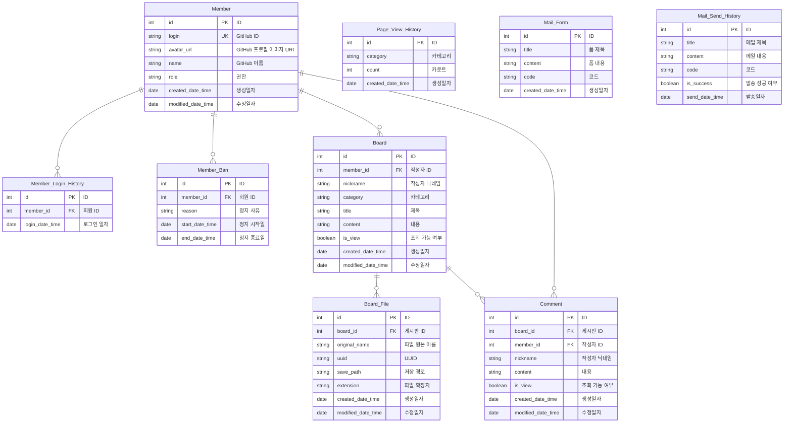

# GitConnect 🔗

> 개발자를 위한 Github 계정 및 저장소 정보 공유 서비스  
> GitHub 프로필을 기반으로 개발자들이 서로 연결되고 소통할 수 있는 커뮤니티 플랫폼

📋 **[Git Connect 프로젝트 상세 기획 Notion](https://jjangsky.notion.site/Git-Connect-7b115574255e4ecba555e54781f54c58)**  
🌐 **Service : [git-connect.site](https://www.git-connect.site)**

## 🛠 기술 스택

### Backend Framework
**`Java 17`** & **`Spring Boot 3.3.2`**
- Spring Data JPA + Querydsl을 활용한 효율적인 데이터 접근
- Spring Security + JWT를 통한 안전한 인증/인가
- WebSocket을 활용한 실시간 통신

### Database & Storage
**`MySQL 8.0`**
- 메인 데이터베이스로 관계형 데이터 저장

**`Redis 7.2`**
- 캐싱 및 세션 관리
- 실시간 메시징 시스템 구현

**`MongoDB`**
- 비정형 데이터 저장 (채팅 메시지 등)

**`AWS S3`**
- 파일 업로드 및 저장소

### Monitoring & DevOps
**`Prometheus + Grafana`**
- 애플리케이션 메트릭 수집 및 시각화
- 실시간 모니터링 대시보드

**`Docker & Docker Compose`**
- 컨테이너화된 개발/운영 환경
- 일관된 환경 구성 보장

**`GitHub Actions`**
- CI/CD 파이프라인 구축

### API & Documentation
**`Swagger (SpringDoc OpenAPI)`**
- REST API 자동 문서화
- 대화형 API 테스트 환경 제공

## 🚀 주요 기능

### 1. 사용자 인증 및 회원 관리
**GitHub OAuth 기반 인증 시스템**
- GitHub 계정을 통한 간편한 로그인/회원가입
- JWT 토큰 기반 stateless 인증
- 회원 프로필 관리 및 로그인 이력 추적
- 회원 차단 및 권한 관리 시스템

### 2. 게시판 시스템
**커뮤니티 활동을 위한 게시판**
- 게시글 CRUD (생성, 조회, 수정, 삭제)
- 카테고리별 게시글 분류 및 검색
- 파일 업로드 지원 (AWS S3 연동)
- Redis 캐싱을 통한 성능 최적화

### 3. 계정 및 저장소 홍보
**GitHub 프로필 & 프로젝트 홍보**
- GitHub 계정 홍보 등록 (자기소개, 주요 프로젝트, 기술 스킬)
- GitHub 저장소 홍보 및 관리
- 주간 인기 회원/레포지토리 통계
- 좋아요 기능을 통한 인기도 측정

### 4. 실시간 채팅 시스템
**WebSocket 기반 실시간 소통**
- 채팅방 생성 및 관리
- 실시간 메시지 송수신
- MongoDB를 활용한 채팅 이력 저장
- 비속어 필터링 기능

### 5. 댓글 시스템
**게시글 기반 소통 기능**
- 댓글 작성/수정/삭제
- 댓글 목록 조회 및 페이징
- 작성자 정보 표시

### 6. 알림 시스템
**실시간 이벤트 알림**
- 팔로우 요청, 메시지 수신 알림
- 게시글/댓글 관련 알림
- 알림 읽음 처리 기능

### 7. GitHub API 연동
**GitHub 정보 통합**
- 팔로워/팔로잉 목록 조회
- GitHub 프로필 정보 동기화
- 저장소 정보 연동

### 8. 메일 발송 시스템
**자동화된 이메일 서비스**
- 템플릿 기반 이메일 발송
- 메일 발송 이력 관리
- 알림 및 공지사항 전달

## 📁 프로젝트 구조

```
src/main/java/com/twoclock/gitconnect/
├── domain/                    # 도메인별 비즈니스 로직
│   ├── board/                # 게시판
│   │   ├── dto/              # 데이터 전송 객체
│   │   ├── entity/           # JPA 엔티티
│   │   ├── repository/       # 레포지토리 계층
│   │   ├── service/          # 비즈니스 로직
│   │   └── web/              # REST 컨트롤러
│   ├── chat/                 # 채팅
│   ├── comment/              # 댓글
│   ├── like/                 # 좋아요
│   ├── mail/                 # 메일
│   ├── member/               # 회원
│   ├── notification/         # 알림
│   └── page/                 # 페이지 뷰
├── global/                    # 전역 설정 및 유틸리티
│   ├── config/               # 설정 클래스
│   │   ├── JpaAuditingConfig
│   │   ├── RedisConfig
│   │   ├── S3Config
│   │   ├── SwaggerConfig
│   │   ├── WebSecurityConfig
│   │   └── WebSocketConfig
│   ├── entity/               # 공통 엔티티
│   ├── exception/            # 예외 처리
│   ├── jwt/                  # JWT 인증
│   ├── model/                # 공통 응답 모델
│   ├── s3/                   # S3 서비스
│   ├── security/             # 보안 설정
│   ├── slack/                # Slack 알림
│   └── util/                 # 유틸리티
└── openapi/                   # 외부 API 연동
    └── github/               # GitHub API
```

## 🔧 환경 설정

### Prerequisites
- Java 17+
- Docker & Docker Compose
- Gradle 8.x

### Docker Compose로 인프라 실행
```bash
docker-compose up -d
```

**실행되는 서비스:**
- **MySQL**: `localhost:3306` (gitconnect/admin:1234)
- **Redis**: `localhost:6379`
- **MongoDB**: `localhost:27017` (root:1234)
- **Prometheus**: `localhost:9090`
- **Grafana**: `localhost:3000` (admin/admin)

### 애플리케이션 실행
```bash
./gradlew bootRun
```

## 📡 API 문서

애플리케이션 실행 후 Swagger UI를 통해 API 문서를 확인할 수 있습니다:
- **URL**: `http://localhost:8080/swagger-ui.html`

### 주요 API 엔드포인트

#### 인증 (/api/v1/auth)
- `POST /login` - GitHub OAuth 로그인
- `POST /logout` - 로그아웃
- `POST /refresh` - 토큰 갱신

#### 회원 (/api/v1/members)
- `GET /profile` - 내 프로필 조회
- `PUT /profile` - 프로필 수정
- `GET /members/{id}` - 회원 정보 조회

#### 게시판 (/api/v1/boards)
- `GET /` - 게시글 목록 조회
- `GET /{boardId}` - 게시글 상세 조회
- `POST /` - 게시글 작성
- `PUT /{boardId}` - 게시글 수정
- `DELETE /{boardId}` - 게시글 삭제

#### 채팅 (/api/v1/chat)
- `GET /rooms` - 채팅방 목록
- `POST /rooms` - 채팅방 생성
- `GET /messages/{roomId}` - 메시지 조회
- `WebSocket /ws` - 실시간 메시징

#### 댓글 (/api/v1/comments)
- `GET /{boardId}` - 댓글 목록
- `POST /` - 댓글 작성
- `PUT /{commentId}` - 댓글 수정
- `DELETE /{commentId}` - 댓글 삭제

#### GitHub 연동 (/api/v1/github)
- `GET /followers` - 팔로워 목록
- `GET /following` - 팔로잉 목록

#### 알림 (/api/v1/notifications)
- `GET /` - 알림 목록
- `PUT /{id}/read` - 알림 읽음 처리

## ERD



## 🔒 보안

### 인증 및 권한 관리
- **Spring Security** 기반 엔드포인트 보호
- **JWT 토큰** 기반 stateless 인증
- **OAuth 2.0** GitHub 소셜 로그인
- **권한 기반 접근 제어** (RBAC)

### 데이터 보호
- **비속어 필터링** (BadWordFiltering 라이브러리)
- **XSS, CSRF** 공격 방지
- **SQL Injection** 방지 (JPA 사용)
- **민감 정보 암호화** 저장

## 📊 모니터링

### Prometheus & Grafana
- **메트릭 수집**: Spring Boot Actuator 연동
- **실시간 대시보드**: `http://localhost:3000`
- **알림 설정**: 임계값 기반 알림

### Slack 통합
- **에러 로그** 실시간 알림
- **중요 이벤트** 모니터링
- **시스템 상태** 리포팅

## 🧪 테스트

```bash
# 전체 테스트 실행
./gradlew test

# 특정 테스트 클래스 실행
./gradlew test --tests "*BoardServiceTest"

# 테스트 커버리지 리포트
./gradlew test jacocoTestReport
```

## 📈 성능 최적화

### 캐싱 전략
- **Redis 캐싱**: 자주 조회되는 데이터
- **2차 캐시**: JPA 엔티티 캐싱
- **캐시 무효화**: 데이터 변경 시 자동 갱신

### 쿼리 최적화
- **Querydsl**: 동적 쿼리 최적화
- **N+1 문제 해결**: Fetch Join 활용
- **페이징 처리**: 대용량 데이터 처리

### 비동기 처리
- **Thread Pool**: 비동기 작업 관리
- **WebSocket**: 실시간 통신 최적화
- **이벤트 기반 아키텍처**: 느슨한 결합

## 🌿 브랜치 전략

> 이 프로젝트는 **GitHub Flow** 브랜치 전략을 따릅니다.

### 기본 원칙

1. **`main`** 브랜치는 항상 배포 가능한 상태를 유지
2. 새로운 기능이나 버그 수정은 **`main`에서 분기**하여 작업
3. 기능 완성 후 **Pull Request** 생성 및 코드 리뷰
4. 리뷰 승인 후 **`main`** 브랜치에 병합
5. 병합 후 배포 자동화 (CI/CD)

### 브랜치 네이밍 규칙
- `feat/기능명` - 새로운 기능 개발
- `fix/이슈번호` - 버그 수정
- `hotfix/긴급수정` - 프로덕션 긴급 수정

## 📝 커밋 컨벤션

### 커밋 메시지 형식
```
<type>(<scope>): <subject>

<body>

<footer>
```

### 타입별 규칙
| Type | Description |
|------|-------------|
| **feat** | 새로운 기능 추가 |
| **fix** | 버그 수정 |
| **docs** | 문서 수정 |
| **style** | 코드 포맷팅, 세미콜론 누락 등 |
| **refactor** | 코드 리팩토링 |
| **perf** | 성능 개선 |
| **test** | 테스트 코드 추가/수정 |
| **build** | 빌드 시스템 또는 외부 종속성 변경 |
| **ci** | CI 구성 파일 및 스크립트 변경 |
| **chore** | 기타 변경사항 |
| **revert** | 커밋 되돌리기 |

### 예시
```bash
feat(board): 게시글 검색 기능 추가

- Querydsl을 활용한 동적 검색 구현
- 제목, 내용, 작성자 기준 검색 지원

Resolves: #123
```

## 🤝 기여 방법

1. **Fork** the Project
2. Create your **Feature Branch** (`git checkout -b feat/AmazingFeature`)
3. **Commit** your Changes (`git commit -m 'feat: Add some AmazingFeature'`)
4. **Push** to the Branch (`git push origin feat/AmazingFeature`)
5. Open a **Pull Request**

### PR 체크리스트
- [ ] 코드 스타일 가이드 준수
- [ ] 테스트 코드 작성
- [ ] 문서 업데이트
- [ ] 리뷰어 지정

## 📄 라이선스

이 프로젝트는 MIT 라이선스 하에 있습니다. 자세한 내용은 [LICENSE](LICENSE) 파일을 참조하세요.

## 👥 팀 정보

**Two Clock Team**
- Organization: `com.twoclock`
- Repository: [GitConnect](https://github.com/two-clock/gitconnect)

## 📞 문의

- **이슈 트래커**: [GitHub Issues](https://github.com/two-clock/gitconnect/issues)
- **프로젝트 Wiki**: [GitHub Wiki](https://github.com/two-clock/gitconnect/wiki)
- **Email**: contact@twoclock.com

---

<div align="center">
  Made with ❤️ by Two Clock Team
</div>
